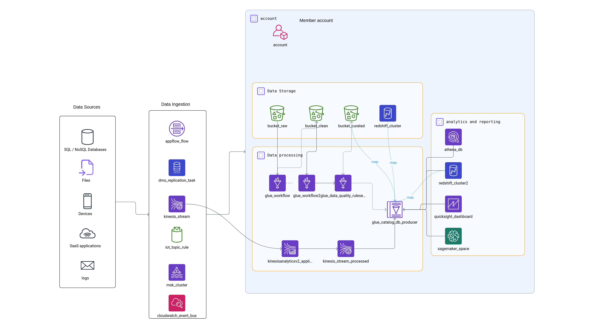

# Lakehouse

Lakehouse combines the best from two worlds: data lakes and relational / data warehouses. Cloud-native implementation of a lakehouse usually includes
- an object storage where data producers can easily load their files;
- files often come in columnar format to decrease memory consumption and accelerate search and querying;
- data catalog with lineage and quality scoring functionality;
- SQL engine that allows to query files as if they relational tables.

[Vision](https://medium.com/@community_md101/the-ultimate-guide-to-choosing-the-right-data-platform-for-ai-innovation-5ffcf1d2ab99) in overall architecture: the lakehouse becomes a central hub that enables plug-and-play constructs: vector DB, feature stores (streaming and batch features), graph engines (e.g. SPARQL), data contracts (to validate and publish schemas upstream/downstream).

## Main features

**Columnar formats**

General problem of high-cardinality.
- high-cardinality data: explosion not only in volume, but also in variety and uniqueness. E.g. in the domain of telemetry: container_id, trace_id, commit_sha.
- traditional databases and search engines were not designed for high-cardinality data. E.g. time-series DB create a series for every combination.
- Similar problems in lakehouse architecture: scan queries are slow and expense.
- High-cardinality is also a problem in machine learning.
- Symptoms: queries become too slow, memory exhaustion, data ingestion lagging because system not able to index the data fast enough.

In the case of lakehouse, columnar formats + partitioning allow to only read attributes that are needed and query the data scopes that are relevant.

**Transactional layer**

Apache Iceberg as an important tool to make tables out of files:
- Iceberg enables Upserts, time travel, concurrency, indexes, transactions.
- Thanks to Iceberg we can add lakehouse functionality in cloud-native way: we can combine cheap storage and analytics over an ACID layer;
- It allows us to perform row-level operations such as updates and deletes on tables in a data lake. When you apply an update or delete operation, the data in S3 is not actually deleted. Rather, a marker record is written according to the Apache Iceberg format specification to indicate that the record is updated or deleted, so subsequent read and write operations get the latest record.
- How does schema evolution work? E.g. if you removed a column from the schema, it does not get actually removed from the files, only from the schema of current version. And if you still want to read the old version, you will see that column in the files where it is present. Similar mechanism for partitions (e.g. daily, hourly): old files get written in old partition, new files - in new partitions.

**Querying**

Best practices for Athena: partitioning and using columnar formats like Parquet - otherwise it scans all data

Pricing model: check not only Athena itself, but also Glue Catalog and S3 (can become the main cost driver):
- limit the number of files, and keep directory hierarchies as flat as possible (Athena will traverse your data set as if it were a file system, so every directory will result in a list operation);
- also has partition indexes.

When you add data to S3 that is not in a location of an existing partition you have to tell Glue / Athena about it, so that Athena can find it when you run your next query. There are multiple mechanisms for that.

## Patterns and lessons learned

- Use S3 tables or general purpose S3 with Self-managed Iceberg - depending on your skills, capacity and priorities. Same dilemma of self-hosted vs. managed (costs, skills, control)
- Iceberg centralizes the authorization layer using IAM; no longer have to built custom data access control layer at each data integration point.
- in Lakehouse, developes need to understand the underlying filesystem. Potentially be familiar with diff. formats, e.g. Avro (for streaming) vs. Parquet (for storage).
- Problem of high-cardinality --> columnar formats + partitioning
- there are multiple mechanisms for repartitioning in Glue / Athena
- Pricing model: when using Athena, check not only Athena itself, but also Glue Catalog and S3 (can become the main cost driver)
- Warehouse is optimized for performance, Lakehouse - for open ecosystem and low costs --> SageMaker provides unified data access and some magic. As usually, be aware of costs.
- ETL vs. zero-ETL vs. federation / virtualization.
    - data gets automatically and continuously replicated from a source system to lakehouse; using change data capture (CDC) to automatically stream all new inserts, updates, and deletes from the source to the target. Use this pattern when 1) data at the source is clean, structured and contextualized; 2) or when data refinement and aggregation can occur at the target end. Transformation is performed at the target - closer to where the insights are generated.
    - Zero-ETL integration for Aurora -> Redshift, S3 or S3 Tables

