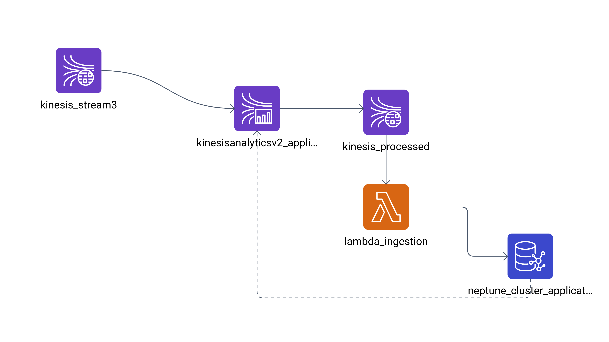

# Streaming

## Kinesis streams

How they work:
- in streaming, you do polling from topics
- only supports HTTP/HTTPS for producing and consuming data via its API
- When a producer application invokes the PutRecord or PutRecords API, the service calculates a MD5 hash for the `PartitionKey` specified in the record. The resulting hash is used to determine which shard to store that record. Each shard gets a range of a 128-bit integer space assigned (e.g. from 0 to 85070591730234615865843651857942052863). --> as diff. keys' hashes may end up in the same range, producing a "hot key", we need high-cardinality keys (e.g., user ID, device ID) and avoid low-cardinality keys (e.g., "region" with only 5 values). Use a composite key if needed (e.g., userID_timestamp).

Fine-tuning:
- configure buffer size: time and size
- compress before putting to S3
- Initial Shard Count: Start with the minimum number of shards needed to handle your expected throughput. --> later can do Resharding (Scaling)
- **Producer Optimizations**. Batching. Compression: compress large payloads before sending to Kinesis. Retry logic: implement exponential backoff for throttled requests.
- **Consumer Optimizations**. Parallel processing: use multiple consumers (one per shard) for parallel reads. Use Enhanced Fan-Out for dedicated throughput (offering each stream consumer its own read throughput).
- Checkpointing: Track progress with DynamoDB or the Kinesis Client Library (KCL) to avoid reprocessing.
- Set up CloudWatch alarms for lag/throttling. Solutions for throttling: increase shard count, use batching of records, implement exponential backoff. What happens in case of throttling: data may get lost --> How to retain data? Data is not lost by default: producers should retry or handle as their data will not be published (also can set up a queue or cache or smth to not lose the data); consumers - retry, backoff.
- Avro is a good format for streaming apps. Binary format that stores both the data and its schema, allowing it to be processed later with different systems without needing the original system's context. Use when schema evolution (changes in data structure) is needed;  Efficient serialization for data transport between systems.
- Switch between Provisioned and On-Demand modes, if needed.

Integrations on AWS:
- built-in `jq` parser of Amazon Data Firehose to extract the keys for partitioning from data records in JSON format.
- Firehose --> S3. Firehose uses Glue tables to understand data structure for converting JSON to Parquet or ORC. When writing to Apache Iceberg tables, Firehose requires a Glue Data Catalog connection to manage table metadata.
- For Iceberg tables, you can perform update and delete operations, but you need to provide the column(s) in the destination table that will be used as unique keys to identify the desired record in the destination
- (for Firehose): implement partitioning on S3. Hive-style partitioning organizes data in a data lake by using folder paths that include key-value pairs (e.g., /year=2023/month=10/day=05/), enabling query engines like Hive, Spark, and Presto to efficiently prune partitions. Partition pruning allows skipping unnecessary partitions, reducing I/O

How to investigate issues:
- We should look for clues to see if we're exceeding the overall throughput available in the stream or if we're having a hot shard issue due to an imbalanced partition key distribution.\
- Monitoring - not always helpful. Enhanced shard-level metrics are not enabled by default, so not helpful if you need to perform root cause analysis after an incident; also you can only query the most recent 3 hours of data. Also sometimes metrics get aggregated and you don't see correct picture on plots in CloudWatch. CLI tool Kinesis Hot Shard Advisor (KHS) can help: you can view shard utilization when shard-level metrics are not enabled. This is particularly useful for investigating an issue retrospectively.

Typical problems:
- events coming out of order (judged by their event timestamp, not processing timestamp) --> watermark in Flink = delay, after which the old windows of time is considered complete, so results can be reported, data can be destroyed in Flink (data still stored in Kafka or Kinesis streams as main storage). Watermarks used in interval joins, temporal joins, pattern matching --> leads to higher latency, though.

## Streaming + graph databases

Patterns:
- Ensures that vertices are processed before edges within each partition
- You can set up two streams: one for vertices and another one for edges
- Vertices and edges with the same partition_id should be processed by the same Flink task
