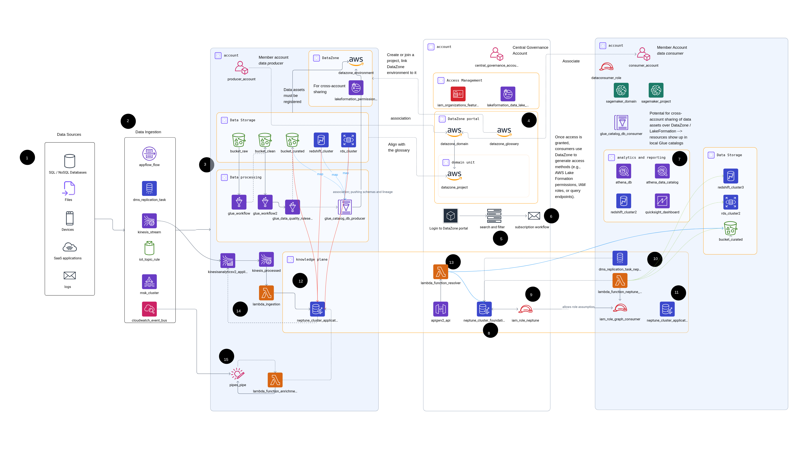

# ref-arch-knowledge-platform-aws
Reference architecture for an enteprise knowledge platform native to AWS

## Goals and scope

The goal is to define target architecture for components which are needed to deploy a resilient and adaptive data architecture on AWS. 

Across organizations I work with, I do see the same drivers and aspirations when it comes to data management and data governance:
- reduce overhead in communication between central and local functions;
- add transactional level over files post-hoc in order to take the best from the relational world and the data lakes;
- build internal data marketplace to boost exchange and, as a result, innovations;
- design the foundation for AI which would ensure explainability and traceability.

After studying how different organizations are architecting their (data) platforms, I came to conclusion that a mix of decentralized ownership and federated computational governance is able to give organizations the necessary ability to adapt and innovate.

I also like to see the big picture and develop holistic solutions. Thus I decided to connect the dots between lakehouse, data mesh and ontology-based data management and create a blueprint which I can reuse.

That is how I started to work on this reference architecture. Although it is done for AWS, these patterns can be used on other platforms, too - I just have the most experience with AWS, and many of my customers are currenly using it, too.

## Description

Points 1-7 are well described in the following reference architecture by AWS: [Data Mesh with Amazon DataZone](https://d1.awsstatic.com/architecture-diagrams/ArchitectureDiagrams/data-mesh-with-amazon-datazone.pdf)

(8) Centralized Neptune in Governance Account. Stores foundational / organization ontologies, mappings (e.g. R2RML)

(9) Neptune has limited integration with other AWS-native services and does not support cross-account access at the data level. However there are [mechanisms](https://docs.aws.amazon.com/neptune/latest/userguide/security-iam-access-manage.html) to access its data using [role chaining](https://docs.aws.amazon.com/neptune/latest/userguide/iam-auth-connecting-gremlin-java.html).

(10) Depending on the use case and architecture, you might want to load actual data to Neptune. You can transform relational data using R2RML mappings and use custom Lambda function, [DMS](https://docs.aws.amazon.com/dms/latest/userguide/CHAP_Target.Neptune.html) service or third-party tools.

(11) Application knowledge graph store application ontologies and, possibly, application data in graph format.

(12) For each dimension in the source data, there is a PID (persistent ID) which leads to an entity in the knowledge graph (in Neptune). This is one of possible ways to link knowledge and data. PID can be queries via SPARQL and additional information can be retrieved. Each row also has a PID and, if necessary, can be transpiled into RDF and loaded into the graph ("materialization"). Check point 10.

(13) For a reverse process of resolution of a global ID into local record ID or S3 path, you might need to write a custom Lambda function. It can be implemented in different ways and execute resolution differently. E.g. PID can point to an ontological concept and local ID; Neptune would store ontological concepts; lineage of data can be fetched from Glue and loaded as RDF triples into Neptune.

(14) Relationship between streaming systems and graph DBs is bi-directional. On one side, streaming tools can enrich real-time data with knowledge and align them with domain and metadata ontologies (although producers should ideally take care of that). On another side, graph DBs can serve as sinks for streaming data. However, note that Neptune (as some other graph DBs, too) has some limitations. At first, its single-writer, multiple-reader architecture, which presents bottlenecks when ingesting large data volumes in real-time. At second, it might struggle with query patterns that involve full dataset scans, property-based filtering, and indexing.

(15) The same pattern of enriching data with context can be applied in event-driven architectures, where domain events need not only be stateless and immutable, but also self-contained, modeled close to domain, scoped to bounded context, and describe the intent - in other words, be interoperable. Producers might use some kind of utility or shared library to inject context into events. In AWS EventBridge, event enrichment can happen via EventBridge Pipes or Lambda functions.

## Navigation through repository
This repo contains multiple folders, each of each represents a certain subset of the main diagram. It can also contain some notes which I made along the way.

## References

Luckily, I did not have to invent everything from scratch. I found inspiration in some existing references architectures, such as:
- Data Mesh with Amazon DataZone: [link](https://d1.awsstatic.com/architecture-diagrams/ArchitectureDiagrams/data-mesh-with-amazon-datazone.pdf)
- Guidance for Connecting Data Products with Amazon DataZone: [link](https://aws.amazon.com/de/solutions/guidance/connecting-data-products-with-amazon-datazone/)
